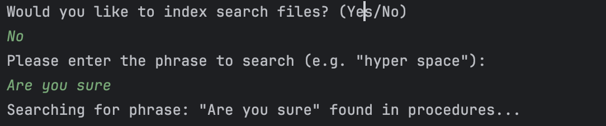
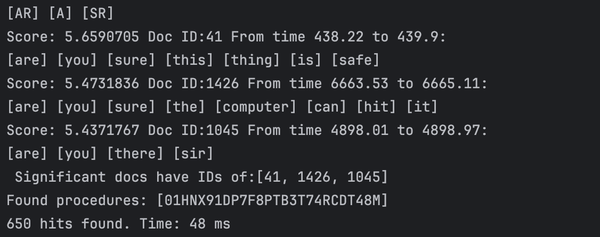

# starWarsLuceneSearch

Command‑line/IDE demo that uses Apache Lucene to index and search Star Wars transcription JSON files. It supports:
- Exact phrase search (Boolean/Phrase queries)
- Phonetic search for misheard/misspelled words (Double Metaphone via lucene‑analyzers‑phonetic)
- Spell suggestions (lucene‑suggest)
- Ranking of results aggregated into bookmark tag IDs with scores

## Prerequisites
- Java: 21+ (project currently targets Java 25 in `pom.xml`)
- Maven: 3.9+
- OS: macOS/Windows/Linux

## Getting started
1) Clone
```
git clone https://github.com/<your-username>/LuceneJsonSearch.git
cd LuceneJsonSearch
```

2) Build dependencies and compile
```
mvn clean package -DskipTests
```
This will download dependencies and compile sources into `target/classes`.

3) Run
You can run from an IDE or via Maven Exec Plugin. The entry point is now:
```
public static void main(String[] args) throws IOException, ParseException
```

- Option A — IntelliJ IDEA (recommended)
  - Open as a Maven project
  - Open `org.jsonsearch.lucene.StarWarsTester`
  - Run the class (Run ▶ StarWarsTester)

- Option B — Maven Exec Plugin (simple CLI run)
  1. Add the following plugin to your `pom.xml` under `<build><plugins>` (see snippet below).
  2. Run:
     ```
     mvn -q -DskipTests exec:java
     ```
     Or explicitly:
     ```
     mvn -q -DskipTests exec:java -Dexec.mainClass=org.jsonsearch.lucene.StarWarsTester
     ```

- Option C — Plain `java` (manual classpath)
  Ensure all deps are on the classpath, then run:
  - macOS/Linux:
    ```
    java -cp "target/classes:$(mvn -q org.codehaus.mojo:exec-maven-plugin:3.5.1:classpath -Dexec.classpathScope=runtime -Dexec.executable=echo -Dexec.args=\"%classpath\")" org.jsonsearch.lucene.StarWarsTester
    ```
  - Windows (PowerShell):
    ```
    java -cp "target/classes;$(mvn -q org.codehaus.mojo:exec-maven-plugin:3.5.1:classpath -Dexec.classpathScope=runtime -Dexec.executable=echo -Dexec.args=\"%classpath\")" org.jsonsearch.lucene.StarWarsTester
    ```
  Using the Maven Exec Plugin (Option B) is simpler.

## Usage
At startup you’ll be prompted:
1) Whether to build indexes (y/n)
   - Data path for JSON files (default: `src/main/resources`)
   - Output path for exact match index (default: `target/index/indexExactWord`)
   - Output path for phonetic index (default: `target/index/indexPhonetic`)
2) Enter the phrase to search (e.g., `hyper space`)

What happens under the hood:
- Exact index is built over the JSON `text` field
- Phonetic index is built to enable Double Metaphone matching
- Spell suggestions are generated using Lucene’s `SpellChecker` over the exact index’s dictionary
- Results are merged and ranked into final bookmark tag IDs with scores

### Runtime flags (CLI)
All search behavior can be tuned at runtime by passing flags via Maven Exec:

- Boosts (influence ranking order):
  - `--boostExact=<float>` (default from code)
  - `--boostPhonetic=<float>`
  - `--boostWildcard=<float>`
  - `--boostFuzzy=<float>`

- Query/search parameters:
  - `--maxSearch=<int>` maximum number of results to retrieve
  - `--slop=<int>` phrase query slop
  - `--minShouldMatch=<int>` minimum number of SHOULD clauses to match in the boolean query
  - `--fuzzyEdits=<0|1|2>` Levenshtein distance for fuzzy queries
  - `--minOccur=<int>` minimum total hits threshold used by the CLI to decide whether to print “significant” results

- Spellchecker controls:
  - `--rebuildSpellIndex` (boolean switch) force rebuilding the spellchecker dictionary index
  - `--spellSuggestionsPerTerm=<int>` suggestions per token (default 2)
  - `--maxSuggestionCombos=<int>` cap on the number of combined suggestion phrases (default 5)

Examples:
```
# Minimal run
mvn -q exec:java

# Tune boosts and query params
mvn -q exec:java -Dexec.args="--boostExact=4 --boostPhonetic=1.5 --boostWildcard=1.1 --boostFuzzy=0.5 --maxSearch=25 --slop=2 --minShouldMatch=1 --fuzzyEdits=2 --minOccur=2"

# Spell suggestions tuning and rebuild
mvn -q exec:java -Dexec.args="--rebuildSpellIndex --spellSuggestionsPerTerm=3 --maxSuggestionCombos=8"
```

The app echoes the effective settings at startup for visibility.

## Configuration
Key constants are defined in `src/main/java/org/jsonsearch/lucene/LuceneConstants.java`:
- `MAX_SEARCH` — maximum number of results
- `MIN_OCCUR` — minimum occurrences of a phrase to count as a hit (default 2)
- `PHRASE_QUERY_SLOP` — slop for phrase queries (default 2)
- Field names: `CONTENTS`, `BOOKMARK_TAG`, etc.

Default directories (can be overridden at runtime):
- Data: `src/main/resources`
- Exact index: `target/index/indexExactWord`
- Phonetic index: `target/index/indexPhonetic`
- Spellchecker dictionary index: `target/index/dictionaryIndex`

### How spell suggestions work
- The spell index is built from the exact content index terms and is reused across runs.
- Pass `--rebuildSpellIndex` to force a rebuild after data changes.
- The app tokenizes your input phrase, suggests per‑term corrections using Lucene `SpellChecker`,
  and then combines them into candidate phrases with a cap (`--maxSuggestionCombos`) to avoid combinatorial explosion.

### Boosting and ranking
- Queries are composed with SHOULD clauses so results can match via exact, phonetic, wildcard, or fuzzy paths.
- Default boosts prioritize exact > phonetic > wildcard > fuzzy. You can adjust these via the boost flags above
  to tune ranking to your dataset.

## Input data
Two example JSON files are provided:
- `src/main/resources/starwars-trans.json`
- `src/main/resources/starwars-trans2.json`

Each JSON object is parsed and indexed, focusing on the `text` field.

## Dependencies
Managed by Maven. Key libraries (aligned to `pom.xml`):
- `org.apache.lucene:lucene-core:10.3.1`
- `org.apache.lucene:lucene-analysis-common:10.3.1`
- `org.apache.lucene:lucene-queryparser:10.3.1`
- `org.apache.lucene:lucene-suggest:10.3.1` (for `SpellChecker`)
- `org.apache.lucene:lucene-analysis-phonetic:10.3.1` (Double Metaphone)
- `org.apache.lucene:lucene-sandbox:10.3.1` (e.g., `PhraseWildcardQuery`)
- `commons-codec:commons-codec:1.20.0`
- `com.googlecode.json-simple:json-simple:1.1.1`

You can adjust versions in `pom.xml` if needed.

## Screenshots
User prompts and results:
- User prompt to enter search and index paths, then phrase
  - `screenshots/intellij_output_user1124.png`
- Result overview
  - `screenshots/intellij_output_user21124.png`
- Spellchecker and bookmark tag IDs ranked by total score
  - `screenshots/intellij_output_bookmarkscores.png`
- Implementation with Boolean query
  - `screenshots/intellij_output_1121.png`
- Earlier implementation without Boolean query
  - `screenshots/intellij_output_1120.png`

Example markdown embedding if desired:
```




```

## Troubleshooting
- No results found: try lowering `MIN_OCCUR` in `LuceneConstants` or use a broader phrase
- Spell suggestions empty: ensure you built the exact index; suggestions are generated from its terms
- Path issues: when prompted, provide absolute paths if your working directory differs
- Mixed Java versions: the project targets Java 25 in `pom.xml`. If building with Java 21, set `maven.compiler.source/target` accordingly

## Project structure
- `src/main/java/org/jsonsearch/lucene/` — core classes: `Indexer`, `Searcher`, `MyPhoneticAnalyzer`, `StarWarsTester`, etc.
- `src/main/resources/` — sample Star Wars transcripts
- `src/test/` — default output locations for indexes used during interactive runs
- `screenshots/` — images used in this README

## Maven Exec Plugin snippet
Add this to your `pom.xml` under `<build><plugins>` to enable `mvn exec:java`:
```xml
<plugin>
  <groupId>org.codehaus.mojo</groupId>
  <artifactId>exec-maven-plugin</artifactId>
  <version>3.5.1</version>
  <configuration>
    <mainClass>org.jsonsearch.lucene.StarWarsTester</mainClass>
  </configuration>
  <executions>
    <execution>
      <goals>
        <goal>java</goal>
      </goals>
    </execution>
  </executions>
  
</plugin>
```

## License
Add your preferred license here (e.g., MIT). If none is specified, this section can be removed.


